# `way` — Architecture

## Executive Summary

`way` is a cross-tool repository of nine workflow skills that separate
architecture from planning from implementation, with explicit review
gates between each stage. Two long-lived design artifacts (current
architecture and current detailed design) survive every cycle; everything
else is transient and archived at the end. The framework is opt-in per
element: trivial work bypasses it, substantive design changes flow
through it. The brand is "a way of doing things" — humble framing, not a
manifesto.

## Goals

- Keep architecture-level design from being drowned in code-level
  detail.
- Bound each phase by the previous phase's approved artifact, so detail
  cannot leak upstream and redesigns cannot leak downstream.
- Maintain a small, readable design corpus per element instead of a
  growing scrap heap.
- Work the same in any tool that can read Markdown and run shell
  commands.

## Non-Goals

- Not a project management system. There are no tickets, assignments,
  or status fields.
- Not a code review system. `way-impl-review` reviews against the plan
  and architecture, not against style guides.
- Not a documentation generator. The two `*-current.md` docs are
  hand-curated outputs of the lifecycle, not auto-generated reports.
- Not a substitute for a coding tool. `way-impl` orchestrates and
  validates, but the underlying agent is whatever the user is running.

## Constraints and Assumptions

- All artifacts are plain Markdown with YAML frontmatter — interpretable
  by any tool.
- The user can run any phase in any supported tool and switch tools
  between phases without losing fidelity.
- The host tool can read files, write files, and run shell commands.
- The user is the orchestrator across phases. No global daemon manages
  workflow state; state is what is on disk.

## System Elements and Responsibilities

The framework is the set of nine `way-*` skills, the shared family
contract, and the per-element artifact set on disk.

- **`way-advisor`** — read-only router. Inspects element state and
  recommends the next skill, or recommends skipping the framework.
- **`way-arch-doc`** — captures current architecture for an element
  that exists in code but has no architecture doc. Never used for
  greenfield work.
- **`way-arch-design`** — proposes new or changed architecture.
  Supports full and delta proposals.
- **`way-arch-review`** — reviews proposals; on approval normalises
  into a full approved doc (mechanically merging deltas).
- **`way-plan`** — elaborates an approved architecture change into an
  ordered, executable plan. Plans are always full but scoped to the
  approved change.
- **`way-plan-review`** — reviews the plan against the approved
  architecture; on approval normalises into an approved plan.
- **`way-impl`** — implements the approved plan, runs validation
  gates, writes a manifest. Escalates rather than silently
  redesigning.
- **`way-impl-review`** — reviews repo state against plan and
  architecture; primary gate for catching architecture-violating
  drift.
- **`way-finalize`** — refreshes the two long-lived docs from the
  approved cycle and archives the transients.

Two persistent design layers per element:

- **Current architecture** — readable structural architecture.
- **Current detailed design** — one level deeper, design-oriented (not
  a code reference). Refreshed from the repo at finalize.

## Dataflow and Interactions

```mermaid
flowchart LR
    advisor([way-advisor])
    archdoc[way-arch-doc]
    archdesign[way-arch-design]
    archreview[way-arch-review]
    plan[way-plan]
    planreview[way-plan-review]
    impl[way-impl]
    implreview[way-impl-review]
    finalize[way-finalize]

    cur[(architecture-current.md)]
    dd[(detailed-design-current.md)]
    archive[(archive/)]

    advisor -->|recommends| archdoc
    advisor -->|recommends| archdesign
    archdoc --> cur
    cur --> archdesign
    archdesign --> archreview
    archreview -->|approve| plan
    archreview -->|revise| archdesign
    plan --> planreview
    planreview -->|approve| impl
    planreview -->|revise| plan
    impl --> implreview
    implreview -->|approve| finalize
    implreview -->|revise| impl
    finalize --> cur
    finalize --> dd
    finalize --> archive

    style cur fill:#264a6e,stroke:#4a90d9,color:#fff
    style dd fill:#264a6e,stroke:#4a90d9,color:#fff
    style archive fill:#264a6e,stroke:#4a90d9,color:#fff
```

The user orchestrates the flow; each skill produces one or two on-disk
artifacts and hands off by recommending the next skill. Architecture
drives plan; plan drives implementation; implementation flows back
through review into the maintained docs.

## Interfaces and Contracts

The on-disk artifact set is the public interface between skills. Every
artifact carries shared frontmatter (`artifact`, `element_key`,
`element_name`, `architecture_scope`, `scope_paths`, `derived_from`,
`last_updated`). Workflow state is **derived from which files exist**
under `.way/elements/<element_key>/`, not from a status field.

Approval contract:

- `architecture-approved.md` is **always full**, regardless of whether
  the proposal was full or delta.
- `plan-approved.md` is always full.
- Approval normalisation is mechanical: review-mandated revisions are
  applied, but unchanged sections are not creatively rewritten.

Escalation contract:

- A planner that needs to redesign an approved architecture must stop
  and escalate to `way-arch-design`.
- An implementer that needs to violate `architecture-approved.md` must
  stop and escalate to `way-arch-design`.
- A reviewer that detects a hidden redesign in a downstream artifact
  rejects rather than revises.

Cross-tool contract:

- Every artifact and every skill is platform-neutral. A user must be
  able to start in Claude Code, switch to Codex mid-cycle, and finish
  in Cursor or Gemini — without changing artifacts or rerunning earlier
  phases.

## Risks and Open Questions

- **Reviewer independence is honour-based.** The skill cannot enforce
  that the user runs the review in a fresh conversation. The mitigation
  is a discipline guard at the top of every review skill, plus the
  documented option to launch a subagent in tools that support it.
- **Planner Constraints depend on the architect noticing them.** If an
  architect fails to write down a constraint, downstream phases will
  not enforce it.
- **Threshold guidance for the off-ramp is qualitative.** v1 ships a
  rule of thumb; tuning is deferred to evidence from real use.
- **Single-cycle implementation in v1.** Larger changes that would
  benefit from per-phase impl/review cadence currently bundle into one
  invocation. The artifact format is phase-aware so v2 can adopt
  per-phase invocation without changing artifacts.

## Planner Constraints

Binding rules a planner targeting the `root` element must respect:

- All artifacts remain plain Markdown with YAML frontmatter. No tool-
  specific extensions in the artifact format.
- Every `way-*` skill remains platform-neutral. No skill may require a
  Claude-specific tool, a Codex-specific tool, etc.
- `architecture-approved.md` and `plan-approved.md` remain full
  documents.
- Workflow state remains file-derived. Do not introduce a `status`
  frontmatter field.
- The framework remains opt-in. Do not add a mode that forces all
  changes through the family.
- The reviewer-independence pattern remains the same shape across the
  three review skills (prefer fresh conversation; in-context discipline
  guards as fallback).

## Deferred Detailed Design

- Concrete on-disk file list per artifact, frontmatter field-by-field
  meaning, archive path scheme, and the exact set of sections per
  document — see `detailed-design-current.md`.
- Specific guidance for handling re-reviews and revisions within a
  cycle — supersede in place; rely on `git log`.
- Self-check pass mechanics for `way-arch-doc` and `way-arch-design`
  (the discipline rule applied to every sentence) — described in
  `detailed-design-current.md`.

## Concurrency and Execution Model

A cycle is a sequential pipeline driven by the user. There is no
concurrency between phases on a single element. Two distinct elements
can be in different phases simultaneously, but they share no state
beyond the repo.

## Deployment and Runtime Context

The framework is installed by symlinking each skill directory under
`skills/` into each supported tool's discovery path. `setup.sh` does
this for Claude Code, Codex CLI, Gemini CLI, Cursor, and VS Code /
Copilot. The `shared/` directory is intentionally outside `skills/` so
it is not discovered as a skill.

## Deep Dive Reference

- `detailed-design-current.md` — artifact contract, frontmatter and
  section catalogs, archive policy, finalize reconciliation rules.
- `shared/family-contract.md` — the single source of truth every
  skill links into via `references/family-contract.md`.

## Applicability Notes

- State and Ownership — N/A — the framework holds no persistent state
  beyond on-disk artifacts; ownership is by-element, captured in
  `scope_paths`.
